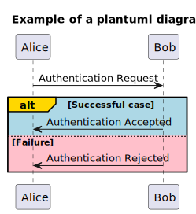
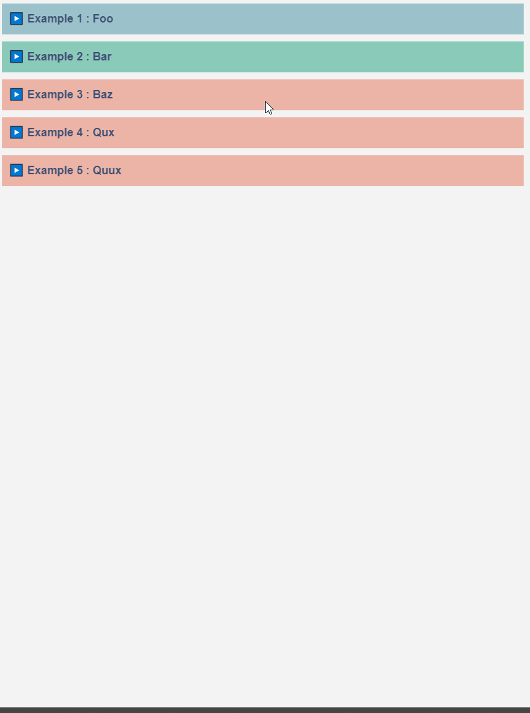
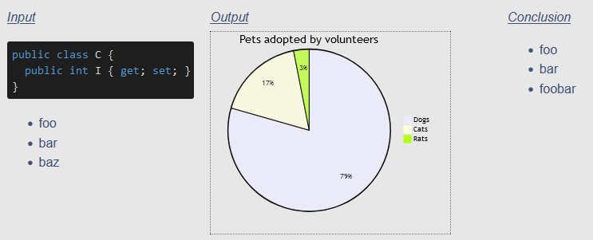
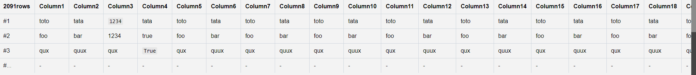

# What is 🖌️ LiveNoteTaking?

Visual supports enhance discussions by providing a way to speed up alignment of understanding.

🖌️ LiveNoteTaking offers:
* a dynamically-refreshing (at file-saving time) preview for markdown files
* the ability to export notes into a standalone file (either standard markdown, either html)


# What does it look like?


You can find a more polished example below:
* generated [preview file](https://htmlpreview.github.io/?https://github.com/Melandel/LiveNoteTaking/blob/main/example_preview.html)
* source [note file](https://raw.githubusercontent.com/Melandel/LiveNoteTaking/main/example.md)

# Which notetaking syntaxes are supported?
Notes have to follow a [markdown syntax](https://www.markdownguide.org/basic-syntax/).

Several enhancements to the standard markdown syntax are also supported, as described below.

## Diagramming
### [D2](https://d2lang.com/tour/intro/) diagrams

Prerequisites:
* the [d2 command-line interface](https://d2lang.com/releases/intro) is installed

Example:


Syntax:

    ```d2 Example of a D2 diagram!
    server
    # Declares a shape inside of another shape
    server.process
    
    # Can declare the container and child in same line
    im a parent.im a child
    
    # Since connections can also declare keys, this works too
    apartment.Bedroom.Bathroom -> office.Spare Room.Bathroom: Portal
    ```
### [Plantuml](https://plantuml.com) diagrams
Prerequisites:
* [java](https://www.java.com) is installed
* [plantuml.jar](https://plantuml.com/download) is installed
* `path-to-desktop/tools/plantuml/plantuml.jar` exists

Example:



Syntax:

    ```puml
    Alice -> Bob: Authentication Request
    alt#Gold #LightBlue Successful case
        Bob -> Alice: Authentication Accepted
    else #Pink Failure
        Bob -> Alice: Authentication Rejected
    end
    ```
### [Mermaid](https://mermaid.js.org/intro/) diagrams
Prerequisites:
* [mermaid-cli](https://github.com/mermaid-js/mermaid-cli?tab=readme-ov-file#mermaid-cli) is installed

Example:



Syntax:

    ```mmd
    journey
        title My working day
        section Go to work
          Make tea: 5: Me
          Go upstairs: 3: Me
          Do work: 1: Me, Cat
        section Go home
          Go downstairs: 5: Me
          Sit down: 3: Me
    ```

## [Collapsible](https://developer.mozilla.org/en-US/docs/Web/HTML/Element/details) sections

Example:



Syntax:

    ```
    {< Foo
    ...
    >}

    {<< Bar
    ...
    >>}

    {<<< Baz
    ...
    >>>}

    {<<< Qux
    ...
    >>>}

    {<<< Quux
    ...
    >>>}
    ```

## MultiColumns

Example:



Syntax:

    ```
    {|462 input
    
    ```cs
    public class C {
      public int I { get; set; }
    }
    ```
    
    * foo
    * bar
    * baz
    
    .| output
    
    ```mmd
    pie title Pets adopted by volunteers
        "Dogs" : 386
        "Cats" : 85
        "Rats" : 15
    ```
    
    .| Conclusion
    * foo
    * bar
    * foobar
    
    |}
    ```

## DataRows

Example:



syntax:

    ```data
    { "count": 2091, "_": [ // lol
      { "Column1": "toto", "Column2": "tata", "Column3": 1234, "Column4": "tata", "Column5": "toto", "Column6": "tata", "Column7": "toto", "Column8": "tata", "Column9": "toto", "Column10": "tata", "Column11": "toto", "Column12": "tata", "Column13": "toto", "Column14": "tata", "Column15": "toto", "Column16": "tata", "Column17": "toto", "Column18": "tata", "Column19": "toto", "Column20": "tata" },
      { "Column1": "foo", "Column2": "bar", "Column3": "1234", "Column4": "true", "Column5": "foo", "Column6": "bar", "Column7": "foo", "Column8": "bar", "Column9": "foo", "Column10": "bar", "Column11": "foo", "Column12": "bar", "Column13": "foo", "Column14": "bar", "Column15": "foo", "Column16": "bar", "Column17": "foo", "Column18": "bar", "Column19": "foo", "Column20": "bar" },
      { "Column1": "qux", "Column2": "quux", "Column3": "qux", "Column4": true, "Column5": "qux", "Column6": "quux", "Column7": "qux", "Column8": "quux", "Column9": "qux", "Column10": "quux", "Column11": "qux", "Column12": "quux", "Column13": "qux", "Column14": "quux", "Column15": "qux", "Column16": "quux", "Column17": "qux", "Column18": "quux", "Column19": "qux", "Column20": "quux" },
     ] }
    ```

|}
